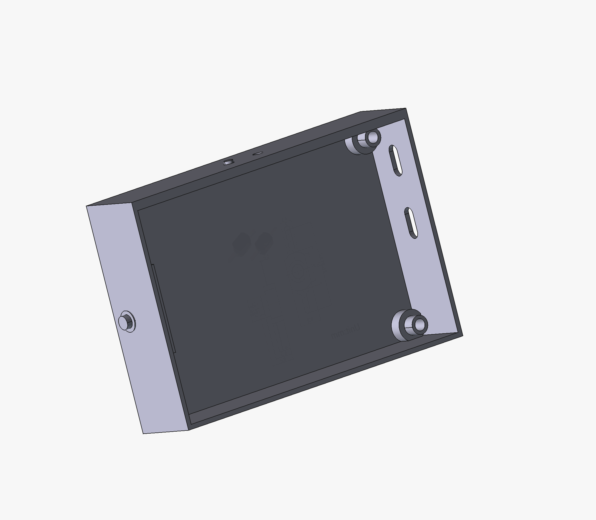

# TrailCurrent Waveshare ESP32-S3 Remote

Touchscreen remote control for the TrailCurrent modular vehicle system, built on the Waveshare ESP32-S3 4.3" touch display with LVGL GUI and ESP-NOW wireless communication.

## Hardware Overview

- **Display:** Waveshare ESP32-S3 4.3" capacitive touchscreen (800x480 RGB)
- **Microcontroller:** ESP32-S3 with 8MB flash, PSRAM (QIO OPI)
- **IO Expander:** CH422G I2C IO expander for display control
- **Communication:** ESP-NOW wireless (peer-to-peer, no WiFi router needed)
- **Key Features:**
  - Multi-page touch interface with bottom navigation bar
  - Real-time vehicle status monitoring
  - Light and accessory control via ESP-NOW to CAN gateway
  - Configurable themes and screen timeout
  - Timezone-aware date/time display
  - User settings persisted in NVS (non-volatile storage)
  - 3D-printable enclosure with battery compartment

## GUI Pages

| Page | Function |
|------|----------|
| **Home** | Status dashboard with warning indicators (lights, water, power, doors, cabinets, stabilizers) |
| **Trailer** | Trailer-specific monitoring and controls |
| **Power** | Battery voltage, state of charge, shore power status, PDM device control |
| **Solar** | Solar charge controller status and wattage |
| **Air** | Temperature (F), humidity, and air quality readings |
| **Settings** | Display theme, screen timeout, gateway MAC address, timezone, connectivity, about/version |

The GUI is designed with [EEZ Studio](https://www.envox.hr/eez/studio/studio-introduction.html) and rendered using LVGL 8.4.0.

## ESP-NOW Protocol

The remote communicates wirelessly with a [TrailCurrentCanEspNowGateway](https://github.com/trailcurrentoss/TrailCurrentCanEspNowGateway), which bridges ESP-NOW messages to/from the CAN bus.

**Receive (Gateway to Remote):**

| ID | Description |
|----|-------------|
| 6 | Date/time (year, month, day, hour, minute, second) |
| 7 | Satellite count, speed (knots), course, GNSS mode |
| 8 | Altitude (scaled, converted to feet) |
| 9 | Latitude and longitude (IEEE 754 floats) |
| 27 | PDM channel status (8 channels, PWM values) |
| 31 | Temperature (C/F) and humidity |
| 35 | Battery voltage and state of charge |
| 36 | Shunt data |
| 44 | Solar charge controller data |

**Transmit (Remote to Gateway):**

The remote sends control commands (channel toggles, brightness changes) to the gateway for relay onto the CAN bus.

## Firmware Setup

**Prerequisites:**
- [PlatformIO](https://platformio.org/) (CLI or IDE plugin)

**Build and upload:**
```bash
# Build firmware
pio run

# Upload to board (serial)
pio run -t upload
```

**Secrets configuration:**

Before building, create `src/secrets.h` with the MAC address of your ESP-NOW gateway:

```cpp
// Copy src/secrets.h.example to src/secrets.h and edit
// NEVER commit secrets.h — it's in .gitignore
uint8_t broadcastAddress[] = {0xAA, 0xBB, 0xCC, 0xDD, 0xEE, 0xFF};
```

## Case Design

A 3D-printable enclosure is included in the `CAD/` directory (FreeCAD format). The case accommodates a battery and physical buttons alongside the built-in touch interface.



## Project Structure

```
├── ASSETS/                       # Images and documentation assets
│   └── CaseDesign.png
├── CAD/                          # 3D-printable enclosure (FreeCAD)
│   └── TrailCurrentWaveshareEsp32s3Remote.FCStd
├── GUI/                          # EEZ Studio GUI project
│   └── TrailCurrentWaveshareEsp32s3Remote.eez-project
├── src/                          # Firmware source
│   ├── main.cpp                  # Application entry, LVGL setup, IO expander init
│   ├── globals.h                 # Version, debug macros
│   ├── espNowHelper.h            # ESP-NOW init, message parsing, data dispatch
│   ├── actions.cpp               # UI event handlers (navigation, settings, themes)
│   ├── vars.cpp                  # State variables, NVS persistence, time conversion
│   ├── secrets.h.example         # Template for ESP-NOW gateway MAC address
│   └── ui/                       # Generated LVGL UI code (from EEZ Studio)
│       ├── screens.h             # Screen and widget object definitions
│       ├── screens.c             # Screen creation and layout
│       ├── styles.h / styles.c   # Theme styles
│       ├── vars.h                # Variable getter/setter declarations
│       ├── actions.h             # Action function declarations
│       ├── images.h / images.c   # Embedded images
│       └── fonts/                # Custom fonts (FontAwesome icons)
├── lib/                          # Local libraries
│   └── ESP32_Display_Panel/      # Waveshare display driver (ESP-IDF based)
├── 8MB_no_ota.csv                # Flash partition table
└── platformio.ini                # Build configuration
```

## Dependencies

| Library | Source | Purpose |
|---------|--------|---------|
| LVGL 8.4.0 | PlatformIO registry | GUI framework |
| ESP32_Display_Panel | Local (`lib/`) | Waveshare display and touch driver |
| ESP-NOW | ESP-IDF built-in | Wireless communication |

## License

MIT License - See LICENSE file for details.

This is open source hardware and software. You are free to use, modify, and distribute under the terms of the MIT license.

## Contributing

Improvements and contributions are welcome! Please submit issues or pull requests.
