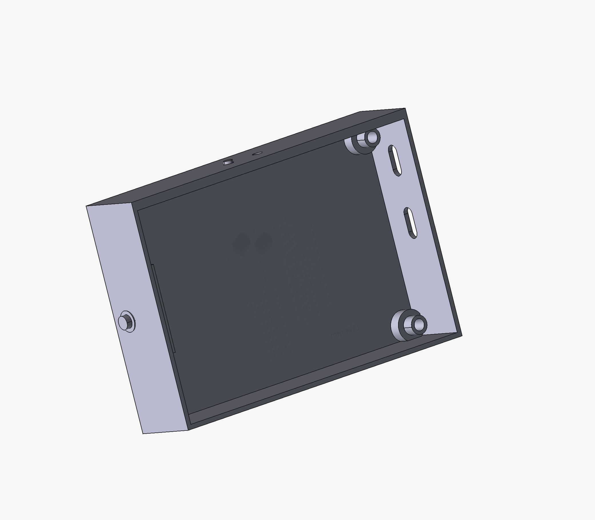

# TrailCurrent Waveshare ESP32-S3 Remote

Touchscreen remote monitor for the [TrailCurrent](https://trailcurrent.com) modular vehicle system, built on the Waveshare ESP32-S3 4.3" touch display with LVGL GUI. Connects to the TrailCurrent server over WiFi using WebSocket for real-time data and REST API for control commands.

## Hardware Overview

- **Display:** [Waveshare ESP32-S3 4.3" capacitive touchscreen](https://www.waveshare.com/product/arduino/boards-kits/esp32-s3/esp32-s3-touch-lcd-4.3.htm?aff_id=Trailcurrent) (800x480 RGB) — small form factor ideal for in-car usage where space is limited, and the ESP32-S3 provides more than sufficient performance for displaying real-time status alerts and alarms while driving
- **Microcontroller:** ESP32-S3 with 8MB flash, PSRAM (QIO OPI)
- **IO Expander:** CH422G I2C IO expander for display control
- **SD Card:** MicroSD slot (SPI on GPIO 11/12/13, CS via CH422G IO expander)
- **Communication:** WiFi (connects to local TrailCurrent server via WebSocket and REST API)
- **Key Features:**
  - Multi-page touch interface with bottom navigation bar
  - Real-time vehicle status monitoring via WebSocket
  - Light and accessory control via REST API
  - SD card configuration — no on-screen credential entry needed
  - Configurable themes and screen timeout
  - Timezone-aware date/time display
  - User settings persisted in NVS (non-volatile storage)
  - 3D-printable enclosure with battery compartment

## GUI Pages

| Page | Function |
|------|----------|
| **Home** | Status dashboard with warning indicators (lights, water, power, doors, cabinets, stabilizers) |
| **Trailer** | Trailer-specific monitoring and controls |
| **Power** | Battery voltage, state of charge, shore power status, PDM device control |
| **Solar** | Solar charge controller status and wattage |
| **Air** | Temperature (F), humidity, and air quality readings |
| **Settings** | Display theme, screen timeout, gateway MAC address, timezone, connectivity, about/version |

The GUI is designed with [EEZ Studio](https://www.envox.hr/eez/studio/studio-introduction.html) and rendered using LVGL 8.4.0.

## Device Configuration

Configuration is loaded from a `config.env` file on a MicroSD card. This avoids typing long credentials on the small touch keyboard.

**Setup steps:**

1. Create a file called `config.env` on a MicroSD card (FAT32 formatted)
2. Add your configuration values:

```
WIFI_SSID=YourNetworkName
WIFI_PWD=YourWiFiPassword
SERVER_NAME=trailcurrent01.local
API_KEY=your-api-key-here
```

3. Insert the SD card into the device and power on (or restart)
4. The device reads the config, saves it to NVS, and connects automatically
5. The SD card can be removed after the first boot — settings persist in NVS

**Notes:**
- `SERVER_NAME` can be a hostname or IP address; `https://` is prepended automatically
- If no configuration exists (no SD card and no saved NVS values), the device shows "Configuration Required — Insert SD card with config.env and restart"
- WiFi and server settings can also be changed manually via the Settings screen
- Re-inserting an SD card with updated values will overwrite the saved NVS settings on next boot

## Communication Protocol

The remote connects to the TrailCurrent server over WiFi using WebSocket for real-time data and REST API for control commands.

**WebSocket (Server to Remote) — real-time updates:**

| Message Type | Data Fields |
|-------------|-------------|
| `temphumid` | Temperature (F), humidity |
| `latlon` | Latitude, longitude |
| `alt` | Altitude (feet) |
| `gnss_details` | Satellite count, speed, course, GNSS mode |
| `energy` | Battery percent, battery voltage, solar watts, charge type |
| `light` | Light ID, state, brightness |

**REST API (Remote to Server) — control commands:**

| Endpoint | Method | Purpose |
|----------|--------|---------|
| `/api/health` | GET | Server health check |
| `/api/lights/{id}` | PUT | Toggle individual light (state, brightness) |
| `/api/lights` | PUT | Bulk light update |
| `/api/thermostat` | PUT | Thermostat control (target temp, mode) |

All API requests include the API key in the `Authorization` header.

## Firmware Setup

**Prerequisites:**
- [PlatformIO](https://platformio.org/) (CLI or IDE plugin)

**Build and upload:**
```bash
# Build firmware
pio run

# Upload to board (serial)
pio run -t upload
```

No secrets files are needed in the source. Device configuration (WiFi credentials, server URL, API key) is loaded at runtime from an SD card — see [Device Configuration](#device-configuration) above.

## Case Design

A 3D-printable enclosure is included in the `CAD/` directory (FreeCAD format). The case accommodates a battery and physical buttons alongside the built-in touch interface.



## Project Structure

```
├── ASSETS/                       # Images and documentation assets
│   └── CaseDesign.png
├── CAD/                          # 3D-printable enclosure (FreeCAD)
│   └── TrailCurrentWaveshareEsp32s3Remote.FCStd
├── GUI/                          # EEZ Studio GUI project
│   └── TrailCurrentWaveshareEsp32s3Remote.eez-project
├── src/                          # Firmware source
│   ├── main.cpp                  # Application entry, LVGL setup, IO expander init, boot flow
│   ├── globals.h                 # Version, debug macros
│   ├── sdConfig.h / sdConfig.cpp # SD card config.env reader
│   ├── wifiHelper.h / .cpp       # WiFi connection management
│   ├── apiClient.h / apiClient.cpp # REST API and WebSocket client
│   ├── actions.cpp               # UI event handlers (navigation, settings, themes, controls)
│   ├── vars.cpp                  # State variables, NVS persistence, time conversion
│   └── ui/                       # Generated LVGL UI code (from EEZ Studio — do not edit)
│       ├── screens.h / screens.c # Screen and widget object definitions
│       ├── styles.h / styles.c   # Theme styles
│       ├── vars.h                # Variable getter/setter declarations
│       ├── actions.h             # Action function declarations
│       ├── images.h / images.c   # Embedded images
│       └── fonts/                # Custom fonts (FontAwesome icons)
├── lib/                          # Local libraries
│   └── ESP32_Display_Panel/      # Waveshare display driver (ESP-IDF based)
├── 8MB_no_ota.csv                # Flash partition table
└── platformio.ini                # Build configuration
```

## Dependencies

| Library | Source | Purpose |
|---------|--------|---------|
| LVGL 8.4.0 | PlatformIO registry | GUI framework |
| ArduinoJson 7.x | PlatformIO registry | JSON parsing for WebSocket messages and REST API |
| WebSockets 2.x | PlatformIO registry | WebSocket client for real-time server communication |
| ESP32_Display_Panel | Local (`lib/`) | Waveshare display and touch driver |
| SD / SPI | ESP32 Arduino built-in | SD card access for config.env |
| WiFi / HTTPClient | ESP32 Arduino built-in | WiFi connectivity and REST API calls |

## License

MIT License - See LICENSE file for details.

This is open source hardware and software. You are free to use, modify, and distribute under the terms of the MIT license.

## Contributing

Improvements and contributions are welcome! Please submit issues or pull requests.
